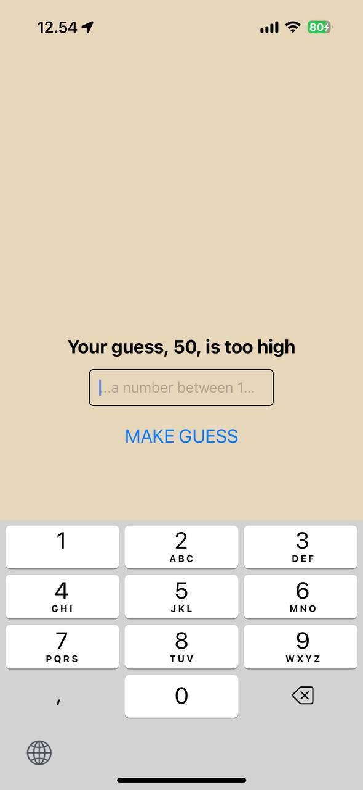

# Number Guessing Game

A React Native game where players try to guess a randomly generated number between 1-100.

## Features

- Random number generation between 1-100
- Real-time feedback on each guess (too high/too low)
- Input validation for non-numeric values
- Guess counter to track attempts
- Automatic input clearing after each guess
- Clean and intuitive user interface

## Screenshots

| Initial State                                             | Guess Too High                                   | Winning State                                |
| --------------------------------------------------------- | ------------------------------------------------ | -------------------------------------------- |
|  |  |  |

## How to Run

1. Clone this repository
2. Navigate to the game directory:
   ```bash
   cd assignment-02-number-guessing/number-guessing
   ```
3. Install dependencies:
   ```bash
   npm install
   ```
4. Run the app:
   ```bash
   npx expo start
   ```
