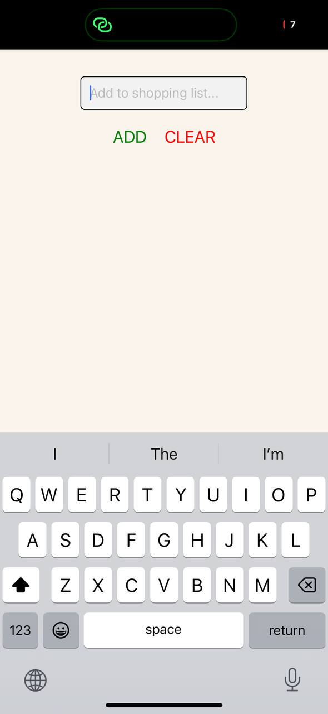
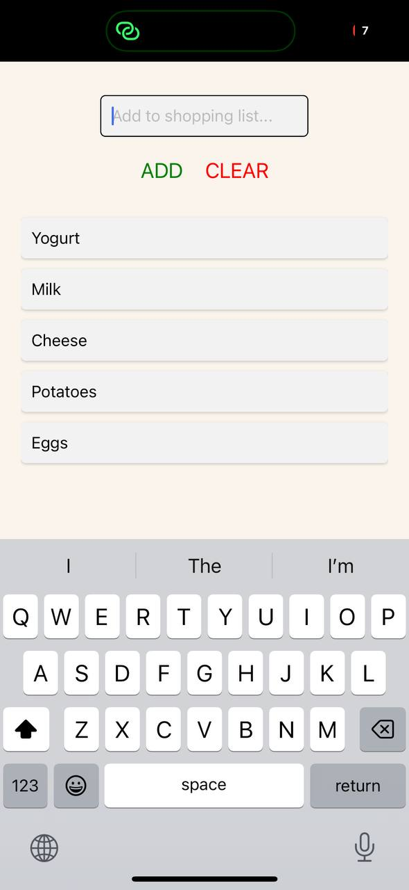

<!-- assignments\assignment-04-shopping-list\README.md -->

# Shopping List App

A simple React Native shopping list application that allows users to manage their shopping items.

## Features

- Add items to shopping list
- View all items in a scrollable list
- Clear entire shopping list
- Input validation for empty items
- Modern UI with shadow effects
- SafeAreaView implementation for proper display on modern devices

## Screenshots

| Shopping List Empty                           | Shopping List with Items                           |
| --------------------------------------------- | -------------------------------------------------- |
|  |  |

## How to Run

1. Clone this repository
2. Navigate to the shopping-list directory
3. Install dependencies:
   ```bash
   npm install
   ```
4. Run the app:
   ```bash
   npx expo start
   ```

## Technologies Used

- React Native
- Expo
- JavaScript
- React Native's core components (SafeAreaView, FlatList)
- React Hooks (useState)

## Project Structure

```
assignment-04-shopping-list/
├── shopping-list/
│   ├── App.js                # Main application file
│   ├── components/
│   │   └── ShoppingList.js   # Shopping list component
│   ├── assets/              # Screenshots and images
│   ├── package.json
│   └── README.md
```

## Development Features

- State management using React Hooks
- Custom styling with shadow effects
- Input validation
- Error handling with Alert component
- Responsive layout design
- Proper list item key management
