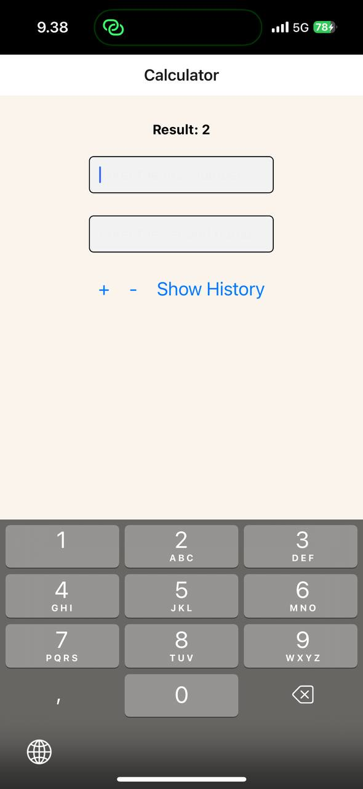

<!-- assignments\assignment-01-and-03-calculator\README.md -->

# Calculator App with History

A React Native calculator app that performs basic arithmetic operations and maintains calculation history.

## Features

- Input two numbers and perform addition or subtraction
- View complete calculation history
- Input validation to handle non-numeric values
- Clean and intuitive user interface
- SafeAreaView implementation for proper display on modern devices

## Screenshots

| Basic Calculator                                 | With History                                         |
| ------------------------------------------------ | ---------------------------------------------------- |
|  |  |

## How to Run

1. Clone this repository
2. Navigate to the calculator directory
3. Install dependencies:
   ```bash
   npm install
   ```
4. Run the app:
   ```bash
   npx expo start
   ```

## Technologies Used

- React Native
- Expo
- JavaScript
- React Native's core components (SafeAreaView, FlatList)

## Project Structure

```
assignment-01-and-03-calculator/
├── App.js                     # Main application file
├── components/
│   └── AddAndSubCalculator.js # Calculator component with history
├── package.json
└── README.md
```

## Development Journey

This app was developed in two phases:

1. Basic calculator functionality (Assignment 1)
2. Addition of calculation history feature (Assignment 3)
